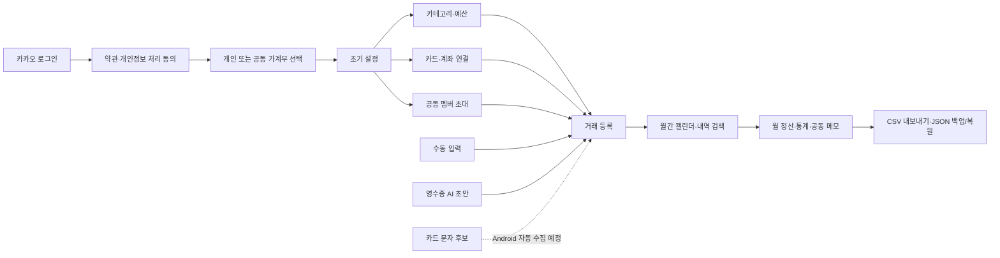

<p align="center">
  
</p>

<h1 align="center">Salimon · 살림온</h1>

<p align="center">
  개인과 공동생활비를 한곳에서 기록하고 정산하는 월간 캘린더 중심 가계부
</p>

## 프로젝트 소개

살림온은 개인 지출부터 가족·커플·룸메이트의 공동생활비까지 함께 관리할 수 있는
가계부입니다. 거래를 단순히 기록하는 데서 그치지 않고, 누가 사용하고 누가
등록했는지 구분하며 월별 예산과 정산 흐름을 한 화면에서 확인하는 것을 목표로
합니다.

현재 Next.js 웹 앱의 주요 기능과 Supabase 데이터 구조가 구현되어 있습니다.
모바일 패키지는 Android 카드 알림 연동을 준비하는 TypeScript 스캐폴드 단계이며,
완성된 React Native 앱은 아닙니다.

## 주요 기능

### 가계부와 공동 관리

- 개인·공동 가계부 생성, 전환, 보관 및 복원
- 초대 코드를 이용한 멤버 초대
- 소유자·관리자·멤버·조회자 역할과 권한 관리
- 기본 가계부 설정, 멤버 내보내기 및 소유권 이전

### 거래 기록

- 지출·수입·저축 거래 등록, 수정, 복사 및 삭제
- 고정 거래와 카드 할부 일정 관리
- 최대 3단계 카테고리, 태그, 카테고리별 분할 금액
- 거래자와 등록자 구분, 정산 포함·제외 상태 관리
- 중복 가능성이 있는 거래 감지

### 조회와 정산

- 월간 캘린더와 날짜별 거래 목록
- 기간·유형·카테고리·멤버·키워드 기반 내역 검색
- 월 수입·지출·저축, 최근 3개월, 멤버·주차·카테고리별 통계
- 카테고리별 예산 대비 실제 지출과 공동 월 정산 메모
- 현재 가계부 CSV 내보내기, 전체 계정 JSON 백업 및 거래 복원

### 입력 보조

- JPG·PNG·WEBP 영수증에서 거래 초안을 추출하는 선택형 Gemini 연동
- 카드 승인 문자 파싱과 미등록 후보 검토
- 카드 문자 예시 제출 전 민감 정보 마스킹 미리보기

> 카드 문자는 현재 웹에서 예시를 입력해 파싱 흐름을 검증할 수 있습니다.
> Android 알림 자동 수집과 로컬 후보함 연동은 향후 구현 범위입니다.

### 개인정보와 데이터

- Supabase Auth 기반 카카오 로그인
- 사용자별 데이터 접근 제어(RLS, 행 단위 보안)
- 거래 상세와 카드·계좌 별칭 등 민감 필드의 데이터베이스 암호화
- 전체 카드번호·계좌번호·계좌 잔액 미수집
- 영수증 원본 이미지를 살림온 서버에 저장하지 않고 분석 요청 후 폐기
- 약관·개인정보 처리방침 동의 기록과 7일 유예 계정 삭제 절차

## 앱 흐름



## 기술 스택

| 영역              | 기술                                               |
| ----------------- | -------------------------------------------------- |
| 웹                | Next.js App Router, React, TypeScript              |
| 상태 관리         | MobX, MobX React Lite                              |
| 스타일·아이콘     | Emotion, 공통 UI 토큰, Lucide React                |
| 인증·데이터베이스 | Supabase Auth, PostgreSQL, RLS                     |
| 영수증 인식       | Google Gemini API                                  |
| 테스트·품질       | Vitest, ESLint 9, TypeScript strict mode, Prettier |
| 모노레포          | pnpm workspace                                     |
| 모바일 기반       | TypeScript 스캐폴드, Android 알림 연동 계획        |

## 저장소 구조

```text
salimon/
├─ apps/
│  ├─ web/                 # Next.js 웹 앱과 영수증 인식 API
│  └─ mobile/              # Android 알림 연동을 위한 초기 스캐폴드
├─ packages/
│  ├─ types/               # 앱 전반에서 공유하는 타입
│  ├─ domain/              # 금액·날짜·카테고리·카드 문자 파싱 로직
│  ├─ api-client/          # Supabase 인증과 데이터 저장소 연결
│  ├─ store/               # MobX 애플리케이션 상태와 유스케이스
│  └─ ui-tokens/           # 색상·간격·모서리 등 디자인 토큰
├─ supabase/migrations/    # 스키마, 접근 권한, 백엔드 함수 변경 이력
└─ docs/                   # 환경 변수, 디자인 시스템, 개발 범위 문서
```

각 공유 패키지는 `types → domain/api-client → store → web`의 책임 경계를
유지합니다. 데이터베이스 변경은 `supabase/migrations`의 번호가 붙은 SQL 파일로
관리합니다.

## 로컬 실행

### 요구 사항

- Node.js 24.15.x
- pnpm 11.7.0
- 카카오 로그인이 설정된 Supabase 프로젝트
- 영수증 인식을 사용할 경우 Gemini API 키

### 설치와 실행

```bash
pnpm install
pnpm dev:web
```

개발 서버는 기본적으로 [http://localhost:3000](http://localhost:3000)에서
실행됩니다.

### 환경 변수

`apps/web/.env.local` 파일을 만들고 아래 값을 설정합니다.

```bash
NEXT_PUBLIC_SUPABASE_URL=
NEXT_PUBLIC_SUPABASE_ANON_KEY=
NEXT_PUBLIC_APP_URL=http://localhost:3000

# 영수증 인식을 사용할 때만 설정
GEMINI_API_KEY=
GEMINI_RECEIPT_MODEL=gemini-3.1-flash-lite
GEMINI_RECEIPT_FALLBACK_MODEL=gemini-3.5-flash-lite
GEMINI_DATA_TIER=free
```

`GEMINI_API_KEY`는 서버 전용 값이므로 `NEXT_PUBLIC_` 접두사를 붙이지 않습니다.
자세한 설정과 데이터 사용 안내는
[환경 변수 문서](docs/environment.md)를 확인해 주세요.

Supabase 스키마는 프로젝트를 연결한 뒤 `supabase/migrations`의 SQL 파일을 번호
순서대로 적용해야 합니다.

## 검증 명령어

```bash
pnpm typecheck
pnpm lint
pnpm test
pnpm build:web
```

## 디자인 원칙

살림온은 금융 데이터를 빠르게 읽을 수 있는 차분하고 밀도 높은 대시보드를
지향합니다. 중립적인 화면 위에서 선택·수입·지출 상태만 제한된 강조색으로
표현하며, 하나의 연속된 데이터 그리드처럼 캘린더와 패널을 구성합니다.

상세 기준은 [디자인 시스템 문서](docs/design-system.md)를 참고해 주세요.

## 로드맵

- React Native 기반 Android 앱 구성
- `NotificationListenerService`를 이용한 카드 알림 감지
- 암호화된 Android 로컬 후보함과 Supabase 동기화
- 카드 문자 후보 검토부터 거래 등록까지의 모바일 흐름 완성
- 배포 및 운영 환경 설정 문서화
