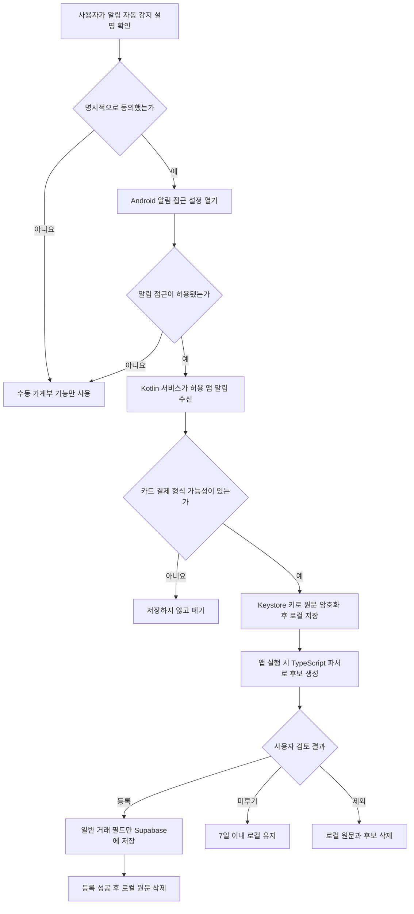
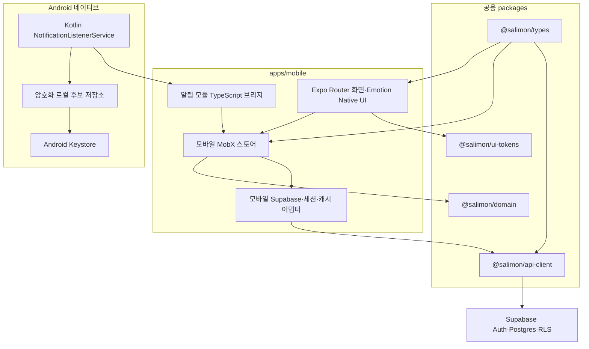
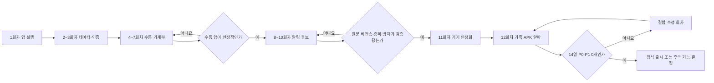

# 살림온 모바일 앱 개발 실행 계획

| 항목             | 내용                                                          |
| ---------------- | ------------------------------------------------------------- |
| 문서 버전        | v1.0                                                          |
| 작성일           | 2026-08-10                                                    |
| 대상             | Android 가족용 비공개 알파                                    |
| 구현 단위        | 12회, 회차별 독립 검증·커밋·푸시                              |
| 앱 기반          | Expo Development Build 기반 React Native + TypeScript + React |
| Android 네이티브 | 알림 수신·권한·암호화 임시 저장만 Kotlin으로 구현             |
| 배포             | 서명된 APK를 가족 기기 3대에 직접 설치                        |
| 정식 출시        | 가족 알파 안정화 후 별도 단계에서 결정                        |
| 상태             | 제품·기술 방향 확정, 구현 전                                  |

## 1. 결론

모바일 앱은 한 번에 웹 기능 전체를 옮기지 않고 **12개 구현 회차**로 나눈다. 각
회차는 다음 회차가 없어도 검증 가능한 결과를 남기는 것을 원칙으로 한다. 예를 들어
로그인이 완성되지 않은 상태에서 거래 화면을 대량으로 만들거나, 후보함 UI가 없는
상태에서 Android 알림 수집부터 백그라운드에서 켜 두지 않는다.

첫 배포 목표는 Google Play가 아니라 가족 3명이 실제 생활에서 사용하는 비공개
알파다. Galaxy Z Fold5, S24, S25 Ultra에 동일한 서명 키로 만든 APK를 직접
설치하고, 최소 14일 동안 카드 알림 수집과 일반 거래 흐름을 검증한 뒤 정식 출시
여부를 결정한다.

모바일 1.0은 다음 두 가치를 우선한다.

1. 휴대전화에서 일반 거래를 빠르게 확인하고 등록한다.
2. Android 카드·문자 알림을 놓치지 않고 안전한 로컬 후보로 만든다.

고정 거래, 카드 할부, 분할 거래는 모바일에서 정확히 표시하되 등록·수정 기능은
후속 단계로 미룬다. 웹에 이미 있는 모든 관리 기능을 모바일 1.0에 복제하지 않는다.

## 2. 확정된 의사결정

| 주제             | 확정 내용                                | 이유                                                                                                                         |
| ---------------- | ---------------------------------------- | ---------------------------------------------------------------------------------------------------------------------------- |
| 1차 플랫폼       | Android만 지원                           | 알림 자동 감지가 Android 고유 기능이고 가족 테스트 기기가 모두 Android다.                                                    |
| 앱 프레임워크    | Expo Development Build 기반 React Native | React·TypeScript 생산성을 유지하면서 로컬 Kotlin 모듈을 포함할 수 있다. Expo Go는 사용하지 않는다.                           |
| 네이티브 언어    | Kotlin                                   | `NotificationListenerService` 구현에 Android 네이티브 코드가 필요하다. Java도 가능하지만 신규 코드에는 Kotlin이 더 적합하다. |
| 로그인           | 카카오 로그인만 지원                     | 웹 계정과 동일한 Supabase 사용자·가계부를 사용한다.                                                                          |
| 데이터 정책      | 온라인 우선                              | 일반 거래 변경은 서버 응답을 확인한 뒤 완료한다. 조회 캐시와 알림 후보만 오프라인을 지원한다.                                |
| 알림 원문        | 기기 내부에만 암호화 저장                | 원문은 서버로 전송하지 않고 최대 7일 후 자동 삭제한다.                                                                       |
| 후보 서버 동기화 | 하지 않음                                | 사용자가 거래 등록을 확정하기 전에는 후보·원문·마스킹 원문을 Supabase에 저장하지 않는다.                                     |
| 1차 배포         | 서명된 APK 직접 설치                     | 현재 Google Play 개발자 계정이 없고 가족 3대만 대상으로 한다.                                                                |
| 고정·할부·분할   | 조회 전용                                | 복잡한 범위별 수정·삭제보다 일반 거래와 알림 등록 안정화를 먼저 달성한다.                                                    |
| AI·데이터 도구   | 모바일 1.0에서 제외                      | 영수증 AI, 월간 AI 분석, CSV·JSON 백업/복원은 후속 범위다.                                                                   |

## 3. 현재 저장소 진단

### 3.1 재사용 가능한 기반

| 영역                  | 현재 상태                                                    | 모바일 활용                                                     |
| --------------------- | ------------------------------------------------------------ | --------------------------------------------------------------- |
| `@salimon/types`      | 거래, 가계부, 카테고리, 결제수단, 알림 후보 타입 보유        | 대부분 그대로 재사용                                            |
| `@salimon/domain`     | 금액·날짜·카테고리·카드 문자 파싱과 테스트 보유              | UI와 무관한 로직을 그대로 재사용                                |
| `@salimon/api-client` | Supabase 조회·저장과 백엔드 함수 호출 구현                   | 클라이언트 주입과 모바일 인증 경계를 분리한 뒤 재사용           |
| `@salimon/store`      | 웹 기능 대부분을 담은 MobX 단일 스토어                       | 전체를 모바일에 가져오지 않고 필요한 유스케이스와 패턴만 재사용 |
| `@salimon/ui-tokens`  | CSS 변수 기반 웹 토큰 보유                                   | 원시 색상값·숫자형 간격을 추가해 웹과 모바일이 함께 사용        |
| Supabase              | 인증, 암호화, 사용자별 접근 통제, 거래 중복 방지 인덱스 보유 | 동일 프로젝트와 사용자 데이터를 사용                            |
| `apps/mobile`         | TypeScript 알림 후보 생성 스텁만 존재                        | 실제 Expo 앱으로 교체·확장                                      |

### 3.2 구현 전에 해소할 구조적 차이

1. `@salimon/api-client`의 Supabase 클라이언트는 `window`와
   `NEXT_PUBLIC_*` 환경변수에 의존한다. 모바일은 `EXPO_PUBLIC_*`, 앱 딥링크,
   네이티브 세션 저장소가 필요하다.
2. 웹 `AppStore`는 모든 거래를 한 번에 불러오고 웹 UI 상태까지 함께 가진다.
   모바일은 선택 월 단위로 데이터를 가져오고 앱 생명주기·오프라인 후보 상태를
   별도로 관리해야 한다.
3. `@salimon/ui-tokens` 값은 `var(--color-...)`, `4px`처럼 웹 전용이다.
   모바일에서 사용할 원시 색상과 숫자 토큰이 필요하다.
4. `FinanceData.smsCandidates`는 현재 항상 빈 배열이며 서버 후보 테이블은 없다.
   이는 후보를 로컬에만 둔다는 이번 개인정보 원칙과 일치하므로, 모바일 1.0에서는
   후보 서버 테이블을 새로 만들지 않는다.
5. 현재 개인정보 처리방침에는 Android 알림 접근, 로컬 원문 보관, 삭제 주기가
   없다. 알림 기능을 실제로 켜기 전에 문서와 앱 내 고지를 함께 변경해야 한다.

### 3.3 변경하지 않을 경계

- 모바일 때문에 웹 컴포넌트를 React Native 호환 형태로 억지로 추상화하지 않는다.
- Next.js 라우팅과 Expo 라우팅을 하나의 공통 UI 계층으로 만들지 않는다.
- Supabase 스키마를 모바일 전용으로 복제하지 않는다.
- 알림 후보 원문을 Supabase에 저장하기 위한 테이블을 만들지 않는다.
- 모바일 1.0을 위해 고정·할부·분할 거래 백엔드 함수를 변경하지 않는다.

## 4. 목표와 성공 기준

### 4.1 제품 목표

1. 앱 실행 후 10초 이내에 현재 월의 가계부 상태를 파악할 수 있다.
2. 일반 거래를 모바일에서 조회·등록·수정·삭제할 수 있다.
3. 지원 대상으로 설정한 카드사 앱 또는 문자 앱의 결제 알림을 로컬 후보로
   수집하고, 사용자가 검토한 뒤 기존 Supabase 거래로 등록할 수 있다.
4. 알림 접근을 허용하지 않아도 수동 가계부 앱으로 정상 사용할 수 있다.
5. Fold5를 접거나 펼쳐도 작성 중인 거래가 사라지거나 화면이 잘리지 않는다.

### 4.2 가족 알파 완료 기준

다음 조건을 모두 만족해야 `가족 알파 안정화`로 판단한다.

- 세 기기에서 동일한 APK를 설치하고 이후 APK로 덮어써 업데이트할 수 있다.
- 카카오 로그인, 앱 재시작 후 세션 복원, 로그아웃이 세 기기에서 정상 동작한다.
- 일반 거래 CRUD 후 웹과 모바일에서 같은 결과가 보인다.
- 고정·할부·분할 거래가 모바일에서 잘못 수정되지 않고 조회 전용으로 표시된다.
- 지원 대상으로 정한 알림 표본에서 금액·시간·가맹점 후보가 예상대로 파싱된다.
- 같은 알림 또는 요약 알림이 반복돼도 같은 거래가 중복 등록되지 않는다.
- 네트워크가 끊긴 동안 후보가 사라지지 않고, 연결 복구 후 사용자가 등록할 수 있다.
- 로그아웃 시 미처리 원문이 삭제되고, 7일이 지난 원문도 자동 삭제된다.
- 14일 연속 실사용 중 데이터 손실·보안 노출·앱 사용 불가 수준의 결함이 없다.
- 해결되지 않은 P0 결함 0개, P1 결함 0개다.

### 4.3 결함 우선순위

| 등급 | 정의                                                     | 예시                                                         |
| ---- | -------------------------------------------------------- | ------------------------------------------------------------ |
| P0   | 개인정보 노출, 데이터 손실·오염, 다른 사용자 데이터 접근 | 알림 원문 서버 전송, 다른 가계부 거래 노출, 거래 금액 오저장 |
| P1   | 핵심 흐름 사용 불가 또는 반복 중복                       | 로그인 불가, 알림 전혀 미수집, 동일 거래 반복 등록           |
| P2   | 우회 가능한 기능 오류                                    | 특정 필터 오류, 일부 화면 깨짐, 갱신 지연                    |
| P3   | 사용성·표현 개선                                         | 문구, 간격, 낮은 우선순위 애니메이션                         |

## 5. 모바일 1.0 범위

### 5.1 포함

| 영역        | 포함 기능                                                           |
| ----------- | ------------------------------------------------------------------- |
| 인증        | 카카오 로그인, 딥링크 콜백, 세션 복원, 로그아웃                     |
| 법적 동의   | 기존 약관·개인정보 동의 확인, 미동의 사용자 동의 기록               |
| 가계부      | 활성 가계부 목록, 기본 가계부 우선 표시, 가계부 전환                |
| 홈          | 현재 월 수입·지출·저축, 예산 사용 현황, 날짜별 거래 요약            |
| 거래 조회   | 월 이동, 기간·유형·카테고리·멤버·키워드 필터, 상세 조회             |
| 일반 거래   | 지출·수입·저축 등록, 일반 거래 수정·삭제, 태그·결제수단·거래자 선택 |
| 복합 거래   | 고정·할부·분할 상태와 세부 내용 조회                                |
| 공동 가계부 | 멤버·권한 표시, 기본 월 정산 요약 조회                              |
| 알림 설정   | 기능 설명, 명시적 동의, 알림 접근 상태, 수집 켜기·끄기              |
| 알림 후보   | 암호화 로컬 저장, 파싱, 검토, 수정, 미루기, 제외, 거래 등록         |
| 오프라인    | 최근 조회 데이터 캐시, 알림 후보 보존, 등록 대기와 재시도           |
| 설정        | 프로필, 앱 버전, 원문 보관 안내, 후보 전체 삭제, 로그아웃           |

### 5.2 제외

| 제외 기능                                   | 후속 처리                               |
| ------------------------------------------- | --------------------------------------- |
| 고정 거래 등록·수정·범위별 종료             | 가족 알파 이후 고급 거래 회차           |
| 카드 할부 등록·수정·범위별 삭제             | 가족 알파 이후 고급 거래 회차           |
| 분할 거래 등록·수정                         | 가족 알파 이후 고급 거래 회차           |
| 카테고리 생성·수정·정렬·보관                | 웹에서 관리, 모바일은 선택·조회만 제공  |
| 카드·계좌 생성·수정·삭제                    | 웹에서 관리, 모바일은 선택·조회만 제공  |
| 가계부 생성·전환·보관·복원                  | 전환은 포함하고 관리 작업은 웹에서 제공 |
| 초대 생성, 역할 변경, 내보내기, 소유권 이전 | 웹에서 제공                             |
| CSV 내보내기, JSON 백업·복원                | 후속                                    |
| 영수증 AI                                   | 후속                                    |
| AI 월간 분석                                | 웹 기능 안정화 후 별도 모바일 기획      |
| Google Play 등록·정식 출시                  | 가족 알파 안정화 후 별도 출시 계획      |
| iOS                                         | Android 안정화 후 별도 타당성 검토      |

## 6. 화면 구조와 핵심 흐름

### 6.1 내비게이션

```text
앱 시작
├─ 로그인
├─ 약관·개인정보 동의
└─ 메인
   ├─ 홈
   │  ├─ 가계부 전환
   │  ├─ 월 이동
   │  ├─ 월 요약·예산
   │  └─ 날짜별 거래
   ├─ 거래
   │  ├─ 필터·검색
   │  ├─ 거래 상세
   │  └─ 일반 거래 등록·수정
   ├─ 후보함
   │  ├─ 알림 수집 설정
   │  ├─ 미처리 후보
   │  └─ 후보 검토·거래 등록
   ├─ 정산
   │  └─ 월 정산 요약 조회
   └─ 설정
      ├─ 프로필·앱 정보
      ├─ 알림 개인정보 설정
      ├─ 후보 전체 삭제
      └─ 로그아웃
```

일반 거래 추가는 거래 탭의 주요 버튼과 홈의 빠른 추가 버튼으로 진입한다. 화면을
항상 차지하는 중앙 플로팅 버튼은 Fold5의 창 크기 변화와 키보드 충돌을 검증한 뒤
필요할 때만 채택한다.

### 6.2 알림 후보 흐름



### 6.3 권한은 두 종류로 분리

| 권한·설정            | 목적                                         | 거부 시 동작                                        |
| -------------------- | -------------------------------------------- | --------------------------------------------------- |
| 알림 접근 특별 권한  | 다른 앱이 올린 카드·문자 알림을 감지         | 후보 자동 수집만 중단, 나머지 앱 정상 사용          |
| `POST_NOTIFICATIONS` | 살림온이 새 후보 검토 알림을 사용자에게 표시 | 후보는 저장하되 시스템 알림 없이 앱 후보함에서 확인 |

두 설정을 하나의 권한처럼 설명하지 않는다. Android 13 이상의
`POST_NOTIFICATIONS`는 살림온이 알림을 **보내는** 권한이고, 다른 앱의 알림을
**읽는** 알림 접근 권한과 다르다.

## 7. 기술 아키텍처

### 7.1 전체 구조



### 7.2 책임 분리

| 계층                | 책임                                                 | 하지 않는 일                               |
| ------------------- | ---------------------------------------------------- | ------------------------------------------ |
| React·TypeScript UI | 화면, 입력, 접근성, 사용자의 최종 결정               | Android 서비스 생명주기 제어               |
| 모바일 MobX 스토어  | 선택 월·가계부, 조회 캐시, 일반 거래 흐름, 후보 상태 | 웹 UI 상태 재사용, 네이티브 암호 직접 구현 |
| 공용 domain         | 파싱, 마스킹, 날짜·금액·카테고리 계산                | 네트워크, 파일, 권한 요청                  |
| 공용 api-client     | Supabase 자료 변환과 저장 호출                       | `window`를 모바일에 노출                   |
| Kotlin 모듈         | 알림 수신, 허용 앱 필터, 암호화 임시 저장, 권한 상태 | 거래 카테고리 결정, Supabase 전송          |
| Supabase            | 인증, 확정 거래, 가계부 권한과 중복 방지             | 미확정 알림 원문·후보 보관                 |

### 7.3 상태 관리 원칙

- 기존 MobX를 유지하고 새 상태 관리 라이브러리를 추가하지 않는다.
- 웹 `AppStore` 전체를 모바일에 주입하지 않는다.
- 모바일 스토어는 `auth`, `workspace`, `month`, `transactionDraft`,
  `notificationInbox` 책임으로 나누되 한 번만 쓰는 추상화 계층은 만들지 않는다.
- 서버 데이터는 선택 월 범위로 조회한다. 웹의 전체 거래 로딩 동작은 유지해 회귀를
  피하고, 모바일만 조회 범위를 전달한다.
- 일반 거래 쓰기는 온라인 성공 후 완료 처리한다.
- 알림 후보 등록은 네트워크 실패 시 `등록 대기`로 남기고 동일 `sourceHash`로
  재시도한다. 데이터베이스의 가계부별 `source_hash` 고유 인덱스를 마지막 방어선으로
  사용한다.

### 7.4 앱 생명주기 원칙

- 앱이 활성화되면 Supabase 세션 자동 갱신을 시작하고 백그라운드에서는 중지한다.
- 앱이 다시 활성화될 때 알림 접근 상태, 세션 상태, 로컬 후보 만료를 다시 확인한다.
- 로그아웃할 때 세션, 조회 캐시, 로컬 알림 원문과 후보를 모두 삭제한다.
- 로그인하지 않았거나 사용자가 알림 수집을 껐다면 Kotlin 서비스는 새 원문을
  저장하지 않는다.
- 재부팅·앱 강제 종료·알림 접근 해제 후 동작은 실제 Samsung 기기에서 검증한다.

## 8. 개인정보와 보안 설계

### 8.1 알림 데이터 분류

| 데이터                  | 저장 위치                             | 보유 기간                     | 서버 전송                        |
| ----------------------- | ------------------------------------- | ----------------------------- | -------------------------------- |
| 알림 원문               | Android 앱 전용 암호화 저장소         | 최대 7일                      | 전송 금지                        |
| 마스킹 원문             | 후보 검토 중 메모리 또는 로컬 후보    | 최대 7일                      | 전송 금지                        |
| 원문 해시               | 로컬 후보, 확정 시 거래 `source_hash` | 후보 삭제 또는 거래 보유 기간 | 확정 거래에만 전송               |
| 파싱 금액·시간·가맹점   | 로컬 후보                             | 최대 7일                      | 사용자가 등록을 누른 경우만 전송 |
| 카드 전체 번호·계좌번호 | 수집·저장 대상 아님                   | 없음                          | 전송 금지                        |
| 허용 앱 패키지 목록     | 앱 설정                               | 사용자가 해제할 때까지        | 전송하지 않음                    |

### 8.2 로컬 암호화

- 암호화 키는 Android Keystore에서 생성하고 내보낼 수 없도록 한다.
- 원문은 AES-GCM 계열의 Android 제공 암호 API로 암호화한다.
- 키·비밀번호·서명 파일을 소스 코드, Git, APK 자산에 넣지 않는다.
- 직접 만든 암호 알고리즘은 사용하지 않는다.
- 복호화 실패, 키 무효화, 앱 데이터 복원 불일치가 발생하면 원문을 폐기하고
  사용자에게 후보 복구가 불가능함을 알린다. 더 약한 저장 방식으로 재시도하지 않는다.

### 8.3 명시적 고지와 동의

알림 접근 설정을 열기 직전에 다음 내용을 앱 화면에 분리해서 고지한다.

1. 살림온이 다른 앱 알림 중 사용자가 허용한 카드·문자 앱의 결제 가능 문구를
   백그라운드에서 확인한다.
2. 원문은 기기에 암호화해 최대 7일 보관하고 사용자가 등록·제외·로그아웃하면
   즉시 삭제한다.
3. 원문과 미확정 후보는 서버로 전송하지 않는다.
4. 사용자는 거부해도 수동 가계부를 계속 사용할 수 있고 설정에서 언제든 수집을
   끌 수 있다.
5. Android 알림 접근 권한은 시스템 특성상 넓지만 살림온은 허용 앱과 결제 형식
   필터를 통과하지 못한 내용을 저장하지 않는다.

이 고지는 개인정보 처리방침 링크만 보여 주는 것으로 대체하지 않는다. 사용자의
`동의하고 설정 열기` 동작 후 Android 설정으로 이동한다.

### 8.4 APK 서명

- 가족용 APK도 디버그 키가 아닌 지속적으로 보관할 전용 서명 키로 서명한다.
- 패키지명과 서명 인증서는 첫 배포 이후 변경하지 않는다.
- `versionCode`를 매 APK마다 증가시켜 기존 앱 위에 업데이트되게 한다.
- 키스토어와 비밀번호는 저장소 밖에 보관하고 별도 암호화 백업을 만든다.
- 구현 에이전트는 키스토어 내용이나 비밀번호를 읽거나 출력하지 않는다.
- 향후 Google Play 전환 시 기존 가족 설치본과 인증서 연속성을 유지할지,
  한 번 삭제 후 Play 버전으로 전환할지 출시 계획에서 결정한다.

## 9. 예상 주요 파일 구조

실제 Expo 생성 결과에 맞춰 최소한으로 조정하되 책임 경계는 다음을 따른다.

```text
apps/mobile/
├─ app/
│  ├─ _layout.tsx
│  ├─ (auth)/
│  │  ├─ login.tsx
│  │  └─ callback.tsx
│  ├─ (tabs)/
│  │  ├─ index.tsx
│  │  ├─ transactions.tsx
│  │  ├─ inbox.tsx
│  │  ├─ settlement.tsx
│  │  └─ settings.tsx
│  └─ transactions/
│     ├─ new.tsx
│     └─ [id].tsx
├─ src/
│  ├─ features/
│  │  ├─ auth/
│  │  ├─ dashboard/
│  │  ├─ transactions/
│  │  ├─ settlement/
│  │  └─ notification-inbox/
│  ├─ infrastructure/
│  │  ├─ supabase.ts
│  │  ├─ authStorage.ts
│  │  └─ queryCache.ts
│  ├─ native/
│  │  └─ notificationListener.ts
│  ├─ stores/
│  │  └─ mobileAppStore.ts
│  └─ theme/
├─ modules/
│  └─ salimon-notification-listener/
│     ├─ android/src/main/AndroidManifest.xml
│     ├─ android/src/main/java/.../
│     └─ src/
├─ app.config.ts
├─ metro.config.js
└─ package.json
```

공용 변경 예상 경로:

- `packages/api-client/src/supabaseClient.ts`
- `packages/api-client/src/authClient.ts`
- `packages/api-client/src/supabaseFinanceRepository.ts`
- `packages/api-client/src/supabaseFinanceRepository.test.ts`
- `packages/types/src/index.ts`
- `packages/domain/src/parser.ts`
- `packages/domain/tests/parser.test.ts`
- `packages/ui-tokens/src/index.ts`
- `docs/environment.md`
- `apps/web/src/app/privacy/page.tsx`

## 10. 의존성 원칙

계획 단계에서는 의존성을 설치하지 않는다. 1회차 시작 전에 기존 의존성으로 해결할
수 있는지 다시 확인하고, 정확한 버전과 추가 이유를 제시해 승인을 받은 뒤
`package.json`과 잠금 파일을 변경한다.

예상 범주는 다음과 같다.

| 범주                    | 목적                                     | 원칙                              |
| ----------------------- | ---------------------------------------- | --------------------------------- |
| Expo·React Native       | 앱 런타임과 네이티브 빌드                | 구현 시점의 상호 호환 버전을 고정 |
| Expo Router             | 파일 기반 화면 이동과 딥링크             | 별도 내비게이션 추상화 추가 금지  |
| Expo Development Client | Kotlin 모듈을 포함한 개발 빌드           | Expo Go는 사용하지 않음           |
| Emotion Native          | 기존 디자인 시스템에 맞는 모바일 스타일  | 다른 스타일 라이브러리 추가 금지  |
| MobX·MobX React Lite    | 모바일 상태 관리                         | 기존 저장소 선택 유지             |
| Supabase JS             | 기존 인증·데이터 연결                    | 모바일 전용 세션 저장 어댑터 사용 |
| 보안 저장소             | 인증 세션 보호                           | 알림 원문 저장소와 책임을 분리    |
| 테스트 도구             | React Native 컴포넌트·사용자 흐름 테스트 | 실제 필요한 최소 도구만 추가      |

## 11. 12회 구현 계획

### 1회차 — Expo 앱 기반과 첫 기기 실행

**목표:** `apps/mobile`을 실제 Android 앱으로 전환하고 세 기기에 설치 가능한
개발 빌드를 만든다.

**작업:**

- Expo TypeScript 앱과 Expo Router 최소 구조 구성
- pnpm workspace, Metro, TypeScript 경로와 공용 패키지 연결
- 앱 이름, Android 패키지명, 딥링크 스킴, 아이콘 기본값 설정
- Android 최소 지원 버전은 API 29(Android 10), 대상은 API 36 이상으로 시작
- Emotion Native 기반 화면·텍스트·버튼·입력 기본 스타일 작성
- `@salimon/ui-tokens`에 모바일용 원시 색상·숫자 토큰을 추가하고 웹 토큰 유지
- 개발용 환경변수 이름만 문서화하고 실제 값은 저장소에 넣지 않음
- 앱 실행, 오류 경계, 개발 정보 화면 추가

**주요 경로:**

- `apps/mobile/package.json`
- `apps/mobile/app.config.ts`
- `apps/mobile/app/_layout.tsx`
- `apps/mobile/app/index.tsx`
- `apps/mobile/src/theme/*`
- `packages/ui-tokens/src/index.ts`
- `docs/environment.md`

**완료 조건:**

- pnpm 루트에서 모바일 타입 검사가 실행된다.
- 공용 `types`, `domain`, `ui-tokens`를 모바일에서 import할 수 있다.
- Fold5, S24, S25 Ultra에 개발 APK를 설치해 첫 화면이 열린다.
- 웹 타입 검사·린트·빌드가 그대로 통과한다.

**시작 전 사용자 확인:** Android 영구 패키지명. 권장값은 `com.salimon.app`이다.

### 2회차 — 웹·모바일 공용 데이터 경계 분리

**목표:** 웹 동작을 깨뜨리지 않고 Supabase 자료 계층을 모바일에서 사용할 수 있게
한다.

**작업:**

- `SupabaseFinanceRepository`가 브라우저 전역 대신 주입받은 Supabase 클라이언트를
  사용할 수 있게 최소 수정
- 기존 웹 기본 클라이언트 경로는 유지
- 모바일에서 선택 월의 시작·종료 범위를 전달할 수 있는 조회 옵션 추가
- 설정 데이터와 선택 월 거래를 모바일 스토어에 채우는 최소 로더 작성
- 웹용 `NEXT_PUBLIC_*`와 모바일용 `EXPO_PUBLIC_*` 환경 구성을 분리
- 브라우저 전용 인증 콜백과 공통 사용자 매핑 로직의 경계 정리
- 클라이언트 주입, 월 범위, 오류 매핑 회귀 테스트 추가

**주요 경로:**

- `packages/api-client/src/supabaseClient.ts`
- `packages/api-client/src/authClient.ts`
- `packages/api-client/src/supabaseFinanceRepository.ts`
- `packages/api-client/src/supabaseFinanceRepository.test.ts`
- `apps/mobile/src/infrastructure/supabase.ts`
- `apps/mobile/src/stores/mobileAppStore.ts`

**완료 조건:**

- 웹은 기존 방식으로 로그인·데이터 로딩이 가능하다.
- 모바일은 테스트 클라이언트를 주입해 선택 월 자료만 로드할 수 있다.
- 전체 거래가 계속 늘어나도 모바일 첫 화면이 전 기간 거래를 요구하지 않는다.
- 공용 패키지 테스트와 웹 빌드가 통과한다.

### 3회차 — 카카오 로그인·세션·법적 동의

**목표:** 실제 가족 계정으로 로그인하고 앱 재실행 후에도 안전하게 세션을 복원한다.

**작업:**

- 모바일 Supabase 세션 저장 어댑터 구성
- 카카오 OAuth 시작과 `salimon://auth/callback` 딥링크 처리
- 앱 활성·백그라운드 상태에 따른 세션 자동 갱신
- 프로필 보장 백엔드 함수 호출과 최초 가계부 생성 흐름 연결
- 약관·개인정보 버전 확인과 동의 화면 구현
- 로그인 오류, 취소, 만료, 로그아웃 처리
- 인증 세션 외 일반 가계부 데이터가 보안 저장소에 섞이지 않도록 분리

**주요 경로:**

- `apps/mobile/app/(auth)/login.tsx`
- `apps/mobile/app/(auth)/callback.tsx`
- `apps/mobile/src/features/auth/*`
- `apps/mobile/src/infrastructure/authStorage.ts`
- `apps/mobile/src/stores/mobileAppStore.ts`
- `packages/api-client/src/authClient.ts`

**완료 조건:**

- 세 기기에서 카카오 로그인 후 같은 Supabase 계정 데이터가 보인다.
- 앱 종료·재실행 후 로그인 상태가 복원된다.
- 만료 세션은 자동 갱신되고 실패하면 로그인 화면으로 안전하게 돌아간다.
- 로그아웃 후 다른 사용자의 캐시 데이터가 남지 않는다.

**외부 설정:** Supabase 허용 리디렉션 URL에 모바일 딥링크를 등록해야 한다. 값은
환경 문서에 이름과 형식만 기록한다.

### 4회차 — 모바일 셸·가계부 전환·월 홈

**목표:** 가족이 매일 열어 볼 수 있는 읽기 중심의 첫 사용 가능한 앱을 만든다.

**작업:**

- 하단 탭과 인증·동의·메인 라우팅 가드 구현
- 기본 가계부 우선 목록과 가계부 전환
- 현재 월 이동, 수입·지출·저축 합계, 예산 사용 현황 표시
- 날짜별 거래 수·금액 요약과 선택 날짜 내역 표시
- 새로고침, 로딩, 빈 데이터, 네트워크 오류 상태
- Fold5 접힘·펼침과 글꼴 크기 확대를 고려한 반응형 배치
- 모바일 조회 캐시의 범위와 만료 기준 구현

**주요 경로:**

- `apps/mobile/app/(tabs)/_layout.tsx`
- `apps/mobile/app/(tabs)/index.tsx`
- `apps/mobile/src/features/dashboard/*`
- `apps/mobile/src/infrastructure/queryCache.ts`
- `apps/mobile/src/stores/mobileAppStore.ts`

**완료 조건:**

- 가계부와 월을 바꾸면 해당 범위의 서버 데이터가 표시된다.
- 웹과 같은 월의 세 합계가 일치한다.
- 네트워크가 없으면 마지막 성공 조회를 읽기 전용으로 보여 준다.
- Fold5를 접고 펼쳐도 선택 월·가계부가 유지된다.

### 5회차 — 거래 목록·필터·상세 조회

**목표:** 현재 월 거래를 모바일에 맞게 탐색하고 모든 거래 형태를 안전하게 읽는다.

**작업:**

- 가상화 목록과 날짜별 그룹 표시
- 기간, 유형, 카테고리, 멤버, 키워드 필터
- 거래 상세에서 거래자·등록자·결제수단·태그·상태 표시
- 고정·할부 회차와 분할 카테고리 상세를 조회 전용으로 표시
- 제외 거래, 삭제된 결제수단, 보관 카테고리 표현
- 긴 가맹점·메모, 큰 금액, 거래가 많은 날짜 성능 검증
- 필터와 표시 계산의 단위 테스트

**주요 경로:**

- `apps/mobile/app/(tabs)/transactions.tsx`
- `apps/mobile/app/transactions/[id].tsx`
- `apps/mobile/src/features/transactions/*`
- 필요 시 `packages/domain/src/*`
- 필요 시 `packages/domain/tests/*`

**완료 조건:**

- 웹과 모바일의 필터 결과와 거래 합계가 일치한다.
- 고정·할부·분할 거래에는 모바일 수정 진입점이 나타나지 않는다.
- 1,000건 수준의 월 데이터에서도 목록 전체를 한 번에 렌더링하지 않는다.

### 6회차 — 일반 거래 등록·수정·삭제

**목표:** 일반 지출·수입·저축을 모바일에서 완결한다.

**작업:**

- 거래 유형, 금액, 날짜·시간, 가맹점, 메모, 거래자 입력
- 유형에 맞는 카테고리와 결제수단 선택
- 수입 종류, 태그, 확정·제외 상태 처리
- 일반 거래 등록·수정·삭제 확인 흐름
- 저장 중 중복 탭 방지, 서버 오류 시 입력 보존, 성공 후 월 데이터 갱신
- 복합 거래는 조회 전용이라는 안내와 웹 관리 링크 제공
- 금액·필수값·권한·카테고리 사용 유형 검증 테스트

**주요 경로:**

- `apps/mobile/app/transactions/new.tsx`
- `apps/mobile/app/transactions/[id].tsx`
- `apps/mobile/src/features/transactions/TransactionEditor.tsx`
- `apps/mobile/src/features/transactions/transactionDraft.ts`
- `apps/mobile/src/stores/mobileAppStore.ts`

**완료 조건:**

- 모바일에서 만든 일반 거래를 웹에서 즉시 확인할 수 있다.
- 웹에서 수정한 일반 거래를 모바일 새로고침 후 확인할 수 있다.
- 네트워크 실패 시 작성 내용은 남고 서버 성공 전 완료 표시를 하지 않는다.
- 권한이 없는 조회자는 저장·수정·삭제 버튼을 볼 수 없다.

### 7회차 — 공동 가계부와 기본 정산 조회

**목표:** 개인·공동 가계부를 모두 일상적으로 조회할 수 있게 한다.

**작업:**

- 공동 가계부 멤버, 역할, 거래자·등록자 구분 표시
- 선택 월 정산 포함·제외 거래와 멤버별 부담 요약
- 카테고리·주차·멤버 기준의 핵심 정산 지표
- 월 정산 메모 읽기
- 개인 결제수단의 공개 범위와 사용자 권한 반영
- 역할별 읽기·쓰기 UI 행렬 테스트

**주요 경로:**

- `apps/mobile/app/(tabs)/settlement.tsx`
- `apps/mobile/src/features/settlement/*`
- `apps/mobile/src/stores/mobileAppStore.ts`
- 필요 시 공용 정산 계산을 `packages/domain`으로 이동

**완료 조건:**

- 웹과 모바일의 선택 월 정산 핵심 금액이 일치한다.
- 공동 가계부 조회자가 거래 변경 UI에 접근할 수 없다.
- 다른 멤버의 비공개 결제수단 정보가 모바일 응답이나 화면에 노출되지 않는다.

### 8회차 — Kotlin 알림 수신 모듈과 암호화 저장소

**목표:** UI와 서버 연결 없이도 결제 가능성이 있는 알림을 안전하게 로컬에 보존한다.

**작업:**

- 로컬 Expo 모듈과 `NotificationListenerService` 등록
- 알림 접근 허용 상태 조회와 Android 설정 화면 열기
- 사용자 수집 설정, 허용 앱 패키지 목록, 수집 중지 상태 관리
- 제목·본문·확장 본문에서 필요한 텍스트 추출
- 요약 알림, 진행 알림, 살림온 자체 알림, 빈 알림 제외
- Android Keystore 키와 AES-GCM 암호화 로컬 레코드 저장
- 원문 생성·조회·삭제·7일 만료·전체 삭제 브리지 제공
- 로그아웃 또는 수집 중지 시 원문 전체 삭제
- Kotlin 단위 테스트와 Android 계측 테스트 추가

**주요 경로:**

- `apps/mobile/modules/salimon-notification-listener/android/src/main/AndroidManifest.xml`
- `apps/mobile/modules/salimon-notification-listener/android/src/main/java/.../*`
- `apps/mobile/modules/salimon-notification-listener/src/index.ts`
- `apps/mobile/src/native/notificationListener.ts`

**완료 조건:**

- React Native 앱이 실행 중이지 않아도 지원 대상 알림이 암호화 저장된다.
- 허용 목록 밖 알림은 저장되지 않는다.
- 저장 파일에서 알림 원문을 평문 검색할 수 없다.
- 알림 접근 해제·수집 중지·로그아웃 상태에서는 새 원문이 저장되지 않는다.
- 키가 없거나 복호화에 실패한 원문은 노출 없이 폐기된다.

**시작 전 사용자 입력:** 가족이 실제 사용하는 카드사 앱·은행 앱·문자 앱 이름과
민감정보를 지운 알림 예시가 필요하다. 패키지명은 기기에서 읽기 전용으로 확인한다.

### 9회차 — 알림 동의·설정·후보함

**목표:** 사용자가 알림 접근 범위와 보관 정책을 이해하고 후보를 통제한다.

**작업:**

- 개인정보 고지 화면과 명시적 동의
- 알림 접근 권한, 살림온 알림 표시 권한을 순서대로 요청
- 지원 앱 선택과 대상 기본 가계부 설정
- Kotlin 저장 레코드를 TypeScript 파서에 전달하고 즉시 마스킹
- 신뢰도별 `검토 필요`·`등록 가능` 상태 생성
- 후보 목록, 상세, 미루기, 제외, 전체 삭제
- 후보 개수 배지와 선택적 시스템 알림
- 개인정보 처리방침에 알림 접근·보관·삭제·서버 미전송 내용 반영
- 실제 마스킹 표본을 파서 회귀 테스트에 추가

**주요 경로:**

- `apps/mobile/app/(tabs)/inbox.tsx`
- `apps/mobile/src/features/notification-inbox/*`
- `apps/mobile/src/stores/mobileAppStore.ts`
- `packages/domain/src/parser.ts`
- `packages/domain/tests/parser.test.ts`
- `apps/web/src/app/privacy/page.tsx`

**완료 조건:**

- 동의 전에 Android 알림 접근 설정이 열리지 않는다.
- 권한을 거부해도 수동 거래 기능을 계속 사용할 수 있다.
- 후보 UI에는 카드번호·계좌번호 등 민감정보가 마스킹된다.
- 제외 또는 전체 삭제 후 Kotlin 원문과 TypeScript 후보가 함께 삭제된다.
- 개인정보 처리방침과 앱 내 설명의 보관 기간·전송 정책이 일치한다.

### 10회차 — 후보 검토·거래 등록·오프라인 재시도

**목표:** 알림 한 건을 안전하고 중복 없이 확정 거래로 바꾸는 전체 흐름을 완성한다.

**작업:**

- 후보의 금액·시간·가맹점·가계부·카테고리·결제수단 수정
- 등록 전 일반 거래 유효성·권한 재검증
- `android_sms_notification` 출처와 `sourceHash`로 확정 거래 저장
- 성공 후 원문과 후보 삭제
- 네트워크 실패 시 암호화 원문을 유지한 `등록 대기` 상태와 명시적 재시도
- 연속 탭, 앱 재시작, 동일 알림 재수신에 대한 멱등 처리
- 데이터베이스 고유 인덱스 충돌을 `이미 등록됨` 결과로 변환
- 7일 만료 후보 알림과 자동 삭제

**주요 경로:**

- `apps/mobile/src/features/notification-inbox/CandidateEditor.tsx`
- `apps/mobile/src/features/notification-inbox/candidateRegistration.ts`
- `apps/mobile/src/stores/mobileAppStore.ts`
- `packages/api-client/src/supabaseFinanceRepository.ts`
- `packages/api-client/src/supabaseFinanceRepository.test.ts`

**완료 조건:**

- 하나의 후보가 최대 하나의 활성 거래만 만든다.
- 등록 성공 전에 원문을 삭제하지 않는다.
- 등록 성공 후 웹에서 거래를 확인할 수 있고 서버에는 원문·마스킹 원문이 없다.
- 오프라인 등록 대기는 앱 재시작 후에도 남고 온라인 복구 후 한 번만 등록된다.

### 11회차 — 보안·접근성·성능·기기 안정화

**목표:** 기능 완성 상태를 가족 실사용이 가능한 품질로 끌어올린다.

**작업:**

- 화면 판독기 라벨, 터치 영역, 키보드, 글꼴 확대, 색상 외 상태 표현 점검
- Fold5 접힘·펼침, 회전, 다중 창, 프로세스 재생성 상태 보존 점검
- S24·S25 Ultra의 알림 접근, 배터리 최적화, 재부팅 후 수신 검증
- 느린 네트워크, 오프라인, 세션 만료, 권한 회수, 저장공간 부족 시나리오
- 많은 거래·후보에서 목록 성능과 메모리 사용 확인
- 로그에 알림 원문, 인증 토큰, 가계부 민감 필드가 남지 않는지 검색
- 프로덕션 빌드에서 개발 메뉴·진단 정보 제거
- 크래시·오류 수집을 도입한다면 민감정보 제거 기준을 먼저 확정

**완료 조건:**

- 기기별 필수 시나리오 테스트표가 모두 통과한다.
- P0·P1 결함이 없다.
- 릴리스 로그와 오류 메시지에 민감정보가 포함되지 않는다.
- 프로세스 종료·권한 변경 후에도 후보 저장 상태가 일관된다.

### 12회차 — 서명 APK·가족 배포·14일 알파 시작

**목표:** 세 가족 기기에 업데이트 가능한 비공개 APK를 배포하고 안정화 판단을 위한
운영 절차를 시작한다.

**작업:**

- 영구 패키지명, 버전명, `versionCode` 확정
- 저장소 밖의 전용 서명 키로 릴리스 APK 생성
- APK 서명 검증과 설치 파일 해시 기록
- 세 기기 최초 설치, 로그인, 알림 접근 설정, 샘플 거래 등록
- 두 번째 버전 APK 덮어쓰기 테스트로 업데이트·데이터 유지 확인
- 가족용 설치·업데이트·권한 해제·문제 신고 문서 작성
- 기기·Android·One UI·보안 패치 버전 기록
- 14일 실사용 체크리스트와 결함 기록 양식 작성
- Google Play 계정이나 EAS 클라우드 배포 없이 로컬 배포 경로 검증

**주요 경로:**

- `apps/mobile/app.config.ts`
- Android 빌드·서명 설정 파일 중 비밀이 아닌 부분
- `docs/mobile-private-distribution.md`
- `docs/mobile-family-alpha-checklist.md`
- `.gitignore`의 서명·로컬 환경 파일 제외 규칙

**완료 조건:**

- 세 기기에 같은 서명의 릴리스 APK가 설치된다.
- 새 `versionCode` APK가 앱 삭제 없이 업데이트된다.
- 업데이트 후 로그인 세션·서버 데이터·미처리 후보가 정책에 맞게 유지된다.
- 서명 키, 비밀번호, 환경변수 값이 Git과 빌드 로그에 없다.
- 가족이 설치·권한 해제·버전 확인·문제 제보 절차를 문서만 보고 수행할 수 있다.

## 12. 회차 간 게이트



- 3회차가 끝나기 전 실제 재무 데이터 화면을 확장하지 않는다.
- 7회차까지의 수동 가계부가 안정되기 전 알림 자동 수집을 켜지 않는다.
- 9회차 개인정보 고지와 삭제 흐름이 완성되기 전 가족 기기에서 상시 수집하지
  않는다.
- 10회차 중복 방지가 검증되기 전 알림 후보를 실제 거래로 빠르게 등록하도록
  유도하지 않는다.
- 14일 알파 중 P0가 한 번이라도 발생하면 알림 수집을 끄고 원인을 해결한 새 APK로
  테스트 기간을 다시 시작한다.

## 13. 검증 전략

### 13.1 코드 검증 순서

코드가 변경되는 1~12회차는 기본적으로 Tier C로 다룬다.

1. `pnpm typecheck`
2. `pnpm lint`
3. 변경 패키지와 모바일 관련 테스트
4. `pnpm build:web`
5. Android 개발 또는 릴리스 APK 빌드
6. 해당 회차의 실제 기기 시나리오

공유 패키지를 바꾼 회차는 웹 빌드를 반드시 통과시켜 모바일 작업이 안정화된 웹을
깨뜨리지 않았는지 확인한다. Kotlin 변경 회차는 TypeScript 검사만으로 끝내지 않고
Gradle 단위·계측 테스트와 실제 기기 수신 테스트를 실행한다.

### 13.2 기기 검증표

| 시나리오                | Fold5 |    S24    | S25 Ultra |
| ----------------------- | :---: | :-------: | :-------: |
| 최초 설치·카카오 로그인 | 필수  |   필수    |   필수    |
| 앱 업데이트·데이터 유지 | 필수  |   필수    |   필수    |
| 알림 접근 허용·회수     | 필수  |   필수    |   필수    |
| 앱 종료 중 알림 수신    | 필수  |   필수    |   필수    |
| 재부팅 후 알림 수신     | 필수  |   필수    |   필수    |
| 오프라인 후보 보존      | 필수  |   필수    |   필수    |
| 같은 알림 중복 방지     | 필수  |   필수    |   필수    |
| 접기·펼치기·다중 창     | 필수  | 해당 없음 | 해당 없음 |
| 큰 글꼴·화면 확대       | 필수  |   필수    |   필수    |
| 배터리 절전 상태        | 필수  |   필수    |   필수    |

세 기기가 모두 Samsung이므로 Android API 29, 31, 33, 36 에뮬레이터를 보조로
사용한다. 에뮬레이터는 레이아웃·권한 회귀 확인용이며 카드사 실제 알림 검증을
대체하지 않는다.

### 13.3 카드 알림 표본

- 실제 원문을 GitHub 이슈나 저장소에 붙이지 않는다.
- 사용자 기기에서 전체 카드번호, 이름, 승인번호 등 민감정보를 먼저 제거한다.
- 파서 테스트에는 실제 문자열 대신 동일 구조의 합성 예시를 저장한다.
- 카드사·문자 앱별 정상 승인, 취소, 해외 결제, 할부 표기, 체크카드, 요약 알림을
  구분한다.
- 지원하지 않는 형식은 억지로 자동 등록하지 않고 `검토 필요` 또는 미지원으로
  처리한다.

## 14. 가족 APK 운영 방식

### 14.1 빌드 종류

| 빌드          | 대상        | 특징                                               |
| ------------- | ----------- | -------------------------------------------------- |
| 개발 빌드     | 개발자 기기 | 로컬 개발 서버·디버깅 도구 사용 가능               |
| 가족 알파 APK | 가족 3대    | 개발 서버 없이 실행, 전용 서명, 프로덕션 환경 연결 |

가족 기기에는 디버그 APK를 장기간 설치하지 않는다. 앱이 개발 서버에 의존하거나
디버그 메뉴를 노출하지 않는 릴리스형 APK를 사용한다.

### 14.2 업데이트

1. 이전 APK와 같은 패키지명·서명 키를 사용한다.
2. `versionCode`를 증가시킨다.
3. 빌드 후 서명과 파일 해시를 검증한다.
4. 비공개 채널로 새 APK를 전달한다.
5. 기존 앱을 삭제하지 않고 설치해 업데이트한다.
6. 앱 버전, 로그인, 후보함, 최근 거래를 확인한다.

앱을 삭제하면 로컬 알림 후보는 복구되지 않는다. 확정 거래는 Supabase에 있으므로
재로그인 후 다시 조회할 수 있다.

### 14.3 Google Play 전환 시점

가족 알파 동안 Google Play 개발자 계정을 만들 필요는 없다. 다음 조건을 만족할 때
정식 출시 계획을 별도 작성한다.

- 14일 안정화 기준 통과
- 개인정보 처리방침과 알림 고지가 실제 동작과 일치
- 지원 카드사·문자 앱 범위 확정
- 개발자 계정 유형과 Android 개발자 인증 요구사항 확인
- 개인 계정일 경우 Google Play 비공개 테스트 참여자 12명·14일 확보 가능
- Play Data safety와 금융 기능 신고 항목 검토
- API 36 이상 대상 빌드와 스토어용 AAB 생성 검증

가족 3대의 직접 APK 사용 기간은 Google Play의 12명·14일 테스트로 인정되지 않는
것으로 계획한다.

Android 개발자 인증은 2026년 9월 일부 국가부터 적용되고 2027년 전 세계 확대가
예정되어 있다. 대한민국 가족 기기의 직접 APK 설치를 2027년까지 계속한다면 당시
공식 요구사항을 다시 확인하고, 필요하면 정식 출시 전이라도 개발자 인증과 패키지명
등록을 진행한다.

## 15. 후속 개발 백로그

가족 알파가 안정된 뒤 우선순위를 다시 정한다. 아래 항목은 현재 12회 범위에 포함하지
않는다.

| 후속 묶음   | 후보 작업                                                            |
| ----------- | -------------------------------------------------------------------- |
| 고급 거래   | 고정 거래 등록·범위별 수정·종료, 할부 등록·수정·삭제, 분할 거래 편집 |
| 관리        | 카테고리·카드·계좌 관리, 가계부 생성·보관, 공동 멤버·초대 관리       |
| 입력 확장   | 카메라·사진 선택 기반 영수증 AI, 공유 시트·클립보드 입력             |
| 분석·데이터 | AI 월간 분석, CSV·JSON 내보내기·복원                                 |
| 운영        | Google Play 비공개 테스트, 정책 신고, AAB, 정식 출시                 |
| iOS         | 알림 자동 감지를 제외한 공통 화면 범위와 별도 입력 전략 검토         |

고급 거래는 모바일 1.0 사용 데이터를 확인한 뒤 별도 3~4회로 계획하는 것이
적절하다. Google Play 정식 출시는 기능 구현 회차와 섞지 않고 정책·배포·운영을
중심으로 별도 2~3회 계획한다.

## 16. 구현 중 사용자 의견이 필요한 시점

전체 계획을 다시 묻지 않고 해당 회차에 필요한 선택만 요청한다.

| 시점       | 필요한 의견                       | 권장 기본값                                   |
| ---------- | --------------------------------- | --------------------------------------------- |
| 1회차 시작 | 영구 Android 패키지명             | `com.salimon.app`                             |
| 1회차 시작 | 예상 신규 의존성 승인             | Expo Development Build 최소 구성              |
| 3회차      | Supabase 모바일 리디렉션 설정     | `salimon://auth/callback`                     |
| 8회차      | 실제 사용하는 카드사·은행·문자 앱 | 가족이 사용하는 앱만 허용 목록에 포함         |
| 8~9회차    | 마스킹한 알림 예시                | 앱별 정상·취소 예시부터 시작                  |
| 9회차      | 후보 알림 기본값                  | 기본 켜짐이 아니라 사용자가 별도 동의 후 켜기 |
| 12회차     | APK 전달 채널                     | 접근 제한이 있는 비공개 링크 또는 직접 전달   |
| 알파 종료  | 정식 출시 여부                    | P0·P1 없이 14일 사용 후 결정                  |

## 17. 공식 참고 자료

- [Expo Development Build 소개](https://docs.expo.dev/develop/development-builds/introduction/)
- [Expo 커스텀 네이티브 코드](https://docs.expo.dev/workflow/customizing/)
- [Expo 로컬 모듈 생성](https://docs.expo.dev/more/create-expo-module/)
- [Supabase React Native 인증](https://supabase.com/docs/guides/auth/quickstarts/react-native)
- [Supabase 모바일 딥링크](https://supabase.com/docs/guides/auth/native-mobile-deep-linking)
- [Android NotificationListenerService](https://developer.android.com/reference/android/service/notification/NotificationListenerService.html)
- [Android 알림 접근 설정](https://developer.android.com/reference/android/provider/Settings.html)
- [Android 13 이상 알림 표시 권한](https://developer.android.com/develop/ui/compose/notifications/notification-permission)
- [Android Keystore](https://developer.android.com/privacy-and-security/keystore)
- [Android APK 서명](https://developer.android.com/studio/publish/app-signing)
- [Android 앱 출시 준비](https://developer.android.com/studio/publish/preparing)
- [Google Play 사용자 데이터 고지·동의](https://support.google.com/googleplay/android-developer/answer/10144311)
- [Google Play 비공개 테스트 요구사항](https://support.google.com/googleplay/android-developer/answer/14151465)
- [2026년 Android 대상 API 요구사항](https://developer.android.com/google/play/requirements/target-sdk)
- [Android 개발자 인증](https://support.google.com/android-developer-console/answer/16561738)
